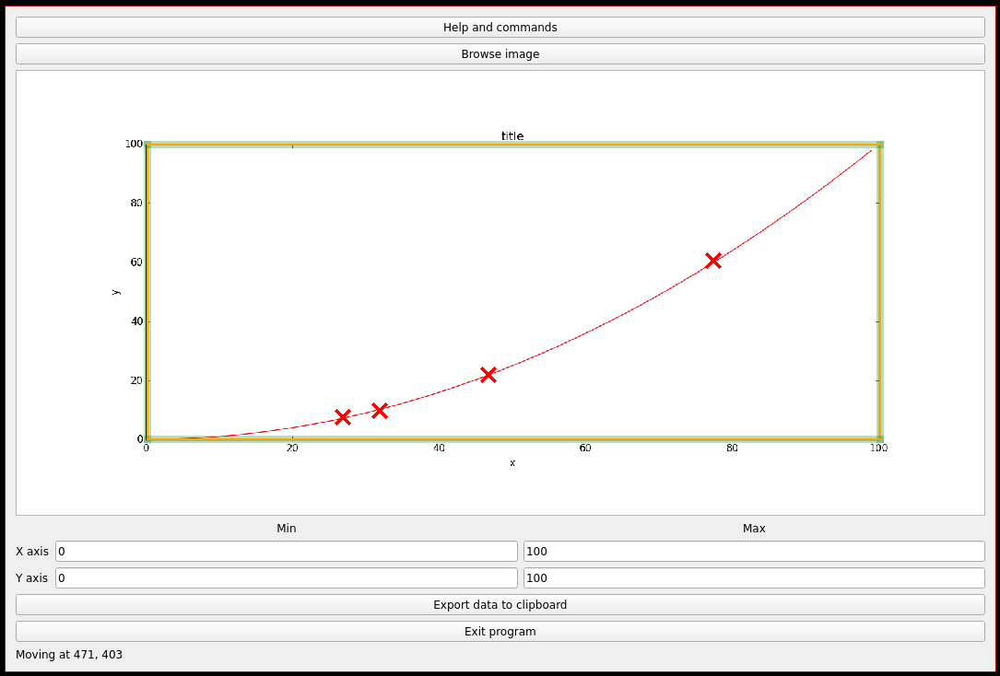

# GRAPH SCANNER - PROJECT PAGE

This software intends to ease the process of extracting numerical data from a graph. The user loads the image of the graph, manually clicks on the datapoints to extract, and send the data to the clipboard.

## Detailed description
Sometimes, interesting numerical data is available as a graph embedded in a picture, instead of a data table. When the data must be processed or used in a calculation, one has to manually choose a few points on the graph and extract their coordinates, in order to create a data table. This program aims at assisting the user in this laborious process. The image is printed on the screen, and the user can click on the curve to mark the points of interest that will be extracted from the graph. The scale, ie the conversion factor between pixels on the screen and the real values, is inferred by locating vertical lines of known abcissa, and horizontal lines of known ordinate (usually the axes of the graph). With the points (and their coordinates in pixels) and the scale, the program can output a data table consistent with the original data.



Example of output stored in clipboard:


```
26.666666666666654	7.499999999999984
31.698113207547163	9.687499999999993
46.54088050314464	21.875
77.23270440251572	60.62500000000001
```


## How to use this program

Load the image with the "Browse image" button.

Adjust the position of the borders (the movable vertical and horizontal lines forming a rectangle around the graph) to match any line of known coordinates. Precision can be increased by zooming in (see "Navigation" below).

Create points (by left clicking) along the curve.

Enter the real scale of the graph by indicating the coordinates of the movable borders in the proper textboxes (xmin, xmax, ymin, ymax).

Export the data to the clipbloard (with the "Export Data" button).

## Navigaton in the graphics area

Zoom in/out: ctrl + wheel

Move inside the image: ctrl + left click

Move a point: left click

Remove a point: right click

Move a border : left click

Adjust the thickness of the points and the borders: alt + wheel

## Config file

A config file is automatically generated when the program is run for the first time. On Windows, the config file is usually in `C:\Documents and Settings\USERNAME\Local Settings\Application Data\graph\graphscanner`. On Linux, it should be found in `/home/USERNAME/.config/graphscanner`.

The config file sets the color of the points, and the colors and thickness of the borders. For the moment, changing these parameters is only possible by editing the config file (there is no GUI for that yet).

Colors must be either a name (list available at [https://upload.wikimedia.org/wikipedia/commons/2/2b/SVG_Recognized_color_keyword_names.svg](https://upload.wikimedia.org/wikipedia/commons/2/2b/SVG_Recognized_color_keyword_names.svg)) or a RGB color with the following format: #RRGGBB (R,G and B being an hexadecimal character). For instance, for the red color, either "red" or "#FF0000" are correct inputs. In case of incorrect input, a default color will be used.

